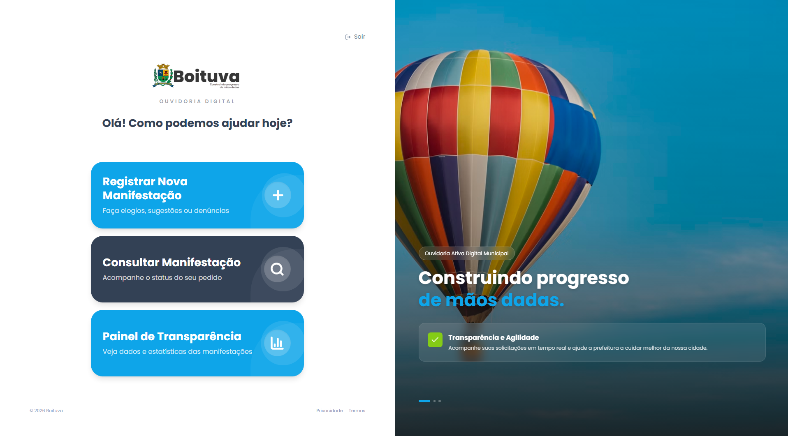
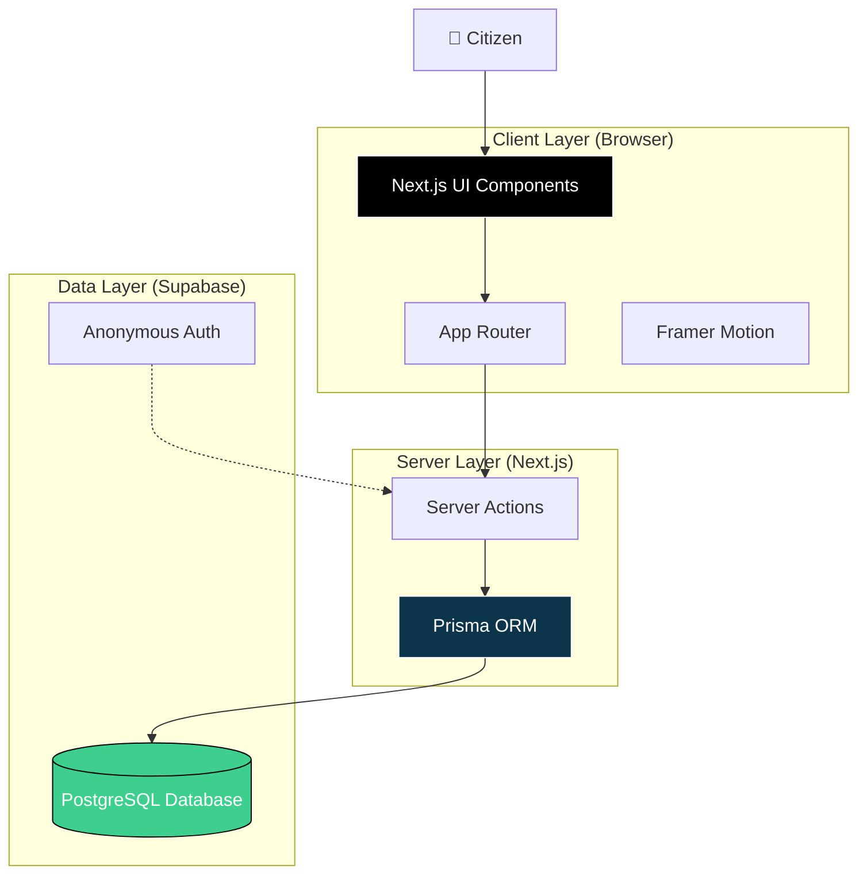

# 🏛️ Active Ombudsman - Boituva




A modern and interactive web application developed for the **Municipal Government of Boituva**, designed to simplify and speed up the registration of public manifestations (compliments, complaints, reports) by citizens.

The project focuses on a **premium user experience (UX)**, featuring fluid design, smooth animations, and a guided flow (Wizard) that makes the process accessible to everyone.

---

## 🏗️ Architecture

The application follows a modern three-tier architecture, leveraging Server Actions for secure backend communication and Supabase for robust data persistence.



### Key Integrations
- **Frontend**: Next.js 16 (App Router) with client-side interactivity via Framer Motion.
- **Backend Logic**: Server Actions handle form submissions and validation.
- **Database**: Supabase PostgreSQL accessed via Prisma ORM for type safety.

---

## ✨ Key Features

- **Guided Flow (Wizard)**: Step-by-step registration (Identification -> Category -> Report -> Finalization).
- **Anonymous Authentication**: Allows citizens to register occurrences without account creation, ensuring data security and ease of access.
- **Supabase Integration**: Secure and scalable data persistence using PostgreSQL.
- **Responsive Design**: Interface optimized for desktops, tablets, and mobile devices.
- **Interactive Animations**: Rich visual feedback using *Framer Motion*.

---

## 🛠️ Technologies Used

- **[Next.js 16](https://nextjs.org/)** - React Framework with App Router and Server Actions.
- **[TypeScript](https://www.typescriptlang.org/)** - JavaScript superset for static typing and security.
- **[Tailwind CSS v4](https://tailwindcss.com/)** - Utility-first CSS framework for rapid styling.
- **[Supabase](https://supabase.com/)** - Backend-as-a-Service (Auth, Database, Storage).
- **[Framer Motion](https://www.framer.com/motion/)** - Animation library for React.
- **[Lucide Icons](https://lucide.dev/)** - Lightweight and consistent vector icons.

---

## 🚀 Installation and Setup

Follow the steps below to run the project locally.

### 1. Clone the Repository

```bash
git clone https://github.com/joaoSilva240/ouvidoria-ativa-boituva.git
cd ouvidoria-ativa-boituva
```

### 2. Install Dependencies

```bash
npm install
```

### 3. Configure Environment Variables

Create a `.env.local` file in the project root and add your Supabase project keys:

```env
NEXT_PUBLIC_SUPABASE_URL=your_project_url
NEXT_PUBLIC_SUPABASE_ANON_KEY=your_public_anon_jwt_key
```

> **Note:** Make sure to enable **"Anonymous Sign-ins"** in the Supabase dashboard (Authentication > Providers).

### 4. Run the Project

```bash
npm run dev
```

Open [http://localhost:3000](http://localhost:3000) in your browser to view the application.

---

## 📄 License

This project is developed for educational and demonstration purposes.

---

Developed with 💙 by [João Silva](https://github.com/joaoSilva240)
