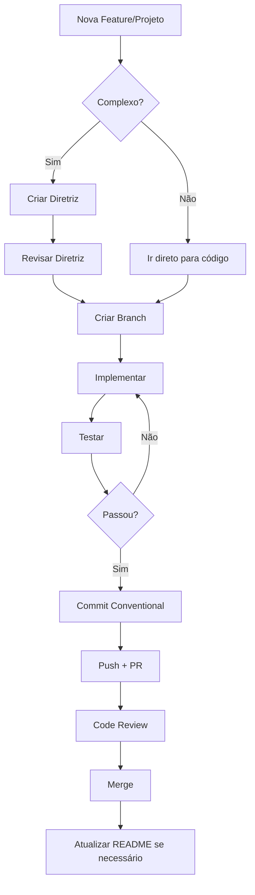

# 📋 Análise de Requisitos - Template para Futuros Projetos

> **Baseado em:** Projeto Ouvidoria Ativa Boituva  
> **Data de criação:** 2026-02-04  
> **Versão:** 1.0

---

## 📖 Sumário

1. [Lições Aprendidas](#lições-aprendidas)
2. [Template de Análise de Requisitos](#template-de-análise-de-requisitos)
3. [Checklist de Início de Projeto](#checklist-de-início-de-projeto)
4. [Estrutura de Diretivas Recomendada](#estrutura-de-diretivas-recomendada)

---

## 🎓 Lições Aprendidas

### ✅ O que funcionou bem

| Prática | Benefício | Exemplo no Projeto |
|---------|-----------|-------------------|
| **DOE Framework** | Organização clara de tarefas | Diretivas bem estruturadas em `/directives` |
| **Diretivas antes da execução** | Evitou retrabalho | `sistema-autenticacao-usuarios.md` mapeou todo o fluxo antes de codar |
| **Conventional Commits** | Histórico limpo e rastreável | `feat:`, `refactor:`, `docs:` |
| **Componentização iterativa** | Redução de código duplicado | `HeroPanel`, `LoadingSpinner`, `PageHeader` |
| **Centralização de utilitários** | Manutenibilidade | `cn.ts`, `date-filters.ts` |
| **Server Actions** | Segurança e simplicidade | Autenticação e CRUD sem API routes |

### ⚠️ O que poderia ter sido melhor

| Problema | Impacto | Solução para Próximos Projetos |
|----------|---------|-------------------------------|
| **Variáveis de ambiente não documentadas inicialmente** | Erro `supabaseKey is required` em produção | Criar `.env.example` no início do projeto |
| **Schema de banco definido durante desenvolvimento** | Migrações incrementais confusas | Definir schema completo na Análise de Requisitos |
| **Componentes duplicados entre páginas** | Refatoração posterior necessária | Identificar componentes reutilizáveis na fase de design |
| **RLS policies criadas tardiamente** | Bugs de acesso | Definir políticas de segurança junto com schema |
| **Autenticação adicionada depois do MVP** | Refatoração de múltiplos arquivos | Planejar autenticação desde o início |

### 🔑 Princípios para Futuros Projetos

1. **Schema First**: Definir estrutura completa do banco ANTES de codar
2. **Auth First**: Se o projeto terá autenticação, implementar ANTES das features
3. **Component Library**: Criar componentes base antes das páginas
4. **Environment Template**: Criar `.env.example` no primeiro commit
5. **Security by Design**: Definir RLS/permissões junto com o schema

---

## 📋 Template de Análise de Requisitos

### 1. Visão Geral do Projeto

```markdown
# [Nome do Projeto]

## Descrição
[Uma frase descrevendo o propósito do projeto]

## Stakeholders
- **Cliente**: [Nome/Organização]
- **Usuários Finais**: [Perfis de usuário]
- **Desenvolvedor**: [Nome]

## Prazo Estimado
- **Início**: [Data]
- **MVP**: [Data]
- **Entrega Final**: [Data]
```

### 2. Requisitos Funcionais

```markdown
## Requisitos Funcionais

### RF01 - [Nome do Requisito]
- **Descrição**: [O que o sistema deve fazer]
- **Prioridade**: Alta | Média | Baixa
- **Critério de Aceite**: [Como validar que está pronto]
- **Dependências**: [Outros RFs necessários]

### RF02 - ...
```

### 3. Requisitos Não-Funcionais

```markdown
## Requisitos Não-Funcionais

### RNF01 - Performance
- Tempo de resposta < 2s para operações comuns
- Suporte a X usuários simultâneos

### RNF02 - Segurança
- Autenticação via JWT
- HTTPS obrigatório
- Dados sensíveis criptografados

### RNF03 - Usabilidade
- Responsivo (mobile-first)
- Acessibilidade WCAG 2.1 AA

### RNF04 - Manutenibilidade
- Cobertura de testes > X%
- Documentação de código
```

### 4. Arquitetura e Stack Tecnológica

```markdown
## Stack Tecnológica

| Camada | Tecnologia | Justificativa |
|--------|------------|---------------|
| Frontend | Next.js 16 | SSR, App Router, Server Actions |
| Estilização | Tailwind CSS | Produtividade, Design System |
| Backend | Supabase | BaaS, Auth integrada, PostgreSQL |
| Animações | Framer Motion | UX premium |
| Ícones | Lucide | Consistência visual |

## Variáveis de Ambiente

| Variável | Descrição | Obrigatória |
|----------|-----------|-------------|
| `NEXT_PUBLIC_SUPABASE_URL` | URL do projeto Supabase | Sim |
| `NEXT_PUBLIC_SUPABASE_ANON_KEY` | Chave pública (JWT) | Sim |
| `SUPABASE_SERVICE_ROLE_KEY` | Chave admin (server-only) | Sim* |

*Apenas se usar operações que bypassam RLS
```

### 5. Modelo de Dados

```markdown
## Schema do Banco de Dados

### Tabela: usuarios/profiles
| Coluna | Tipo | Constraints | Descrição |
|--------|------|-------------|-----------|
| id | UUID | PK, FK(auth.users) | ID do usuário |
| nome | VARCHAR(255) | NOT NULL | Nome completo |
| email | VARCHAR(255) | NOT NULL | Email |
| user_type | ENUM | DEFAULT 'COMUM' | Tipo de acesso |
| created_at | TIMESTAMPTZ | DEFAULT NOW() | Data de criação |

### Tabela: [entidade_principal]
[Definir estrutura]

### Políticas RLS
- `[policy_name]`: [Descrição da política]
```

### 6. Fluxos de Usuário

```markdown
## Fluxos Principais

### Fluxo 1: Registro de Usuário
1. Usuário acessa /registro
2. Preenche: Nome, CPF, Email, Telefone, Senha
3. Sistema valida CPF único
4. Supabase Auth cria usuário
5. Trigger cria profile
6. Redireciona para login

### Fluxo 2: [Outro Fluxo]
[Passos]
```

### 7. Componentes de UI

```markdown
## Componentes Reutilizáveis (identificar antes de codar)

### Componentes de Layout
- [ ] `PageHeader` - Header institucional
- [ ] `LoadingSpinner` - Estado de carregamento
- [ ] `HeroPanel` - Painel decorativo

### Componentes de Formulário
- [ ] `FormInput` - Input estilizado
- [ ] `FormSelect` - Select estilizado
- [ ] `FormTextarea` - Textarea estilizado

### Componentes de Feedback
- [ ] `Toast` - Notificações
- [ ] `Modal` - Diálogos
- [ ] `ErrorBoundary` - Tratamento de erros
```

---

## ✅ Checklist de Início de Projeto

### Antes de Codar

- [ ] Análise de Requisitos completa
- [ ] Schema do banco definido
- [ ] Políticas RLS planejadas
- [ ] Fluxo de autenticação definido (se aplicável)
- [ ] Wireframes/Mockups aprovados
- [ ] Stack tecnológica definida
- [ ] Repositório criado com `.gitignore` correto
- [ ] `.env.example` criado
- [ ] `README.md` inicial com instruções de setup

### Primeiro Dia de Código

- [ ] Configurar projeto base (Next.js, Tailwind, etc.)
- [ ] Configurar Supabase (projeto, chaves, .env.local)
- [ ] Criar migrations do schema
- [ ] Aplicar políticas RLS
- [ ] Implementar autenticação (se aplicável)
- [ ] Criar componentes base (Layout, Headers, etc.)
- [ ] Primeiro commit: `chore: initial project setup`

### Durante o Desenvolvimento

- [ ] Uma feature por branch
- [ ] Commits seguindo Conventional Commits
- [ ] Atualizar README conforme necessário
- [ ] Criar diretivas para features complexas
- [ ] Refatorar código duplicado assim que identificado

---

## 📁 Estrutura de Diretivas Recomendada

```
/directives
├── 00-analise-requisitos.md      # Este documento
├── 01-setup-inicial.md           # Configuração do projeto
├── 02-schema-banco.md            # Definição do banco de dados
├── 03-autenticacao.md            # Sistema de auth
├── 04-feature-[nome].md          # Cada feature complexa
└── 99-hotfixes/                  # Correções urgentes
    └── fix-[nome-do-bug].md
```

### Template de Diretiva

```markdown
# Diretriz: [Nome da Feature/Correção]

**Data:** [YYYY-MM-DD]
**Prioridade:** Alta | Média | Baixa
**Status:** PENDENTE | EM PROGRESSO | CONCLUÍDO

---

## 1. Contexto
[Por que isso é necessário?]

## 2. Objetivo
[O que deve ser alcançado?]

## 3. Plano de Implementação

### Fase 1: [Nome]
- [ ] Tarefa 1
- [ ] Tarefa 2

### Fase 2: [Nome]
- [ ] Tarefa 1

## 4. Arquivos Afetados
- `src/...` (criar/modificar)

## 5. Critérios de Aceite
- [ ] [Critério 1]
- [ ] [Critério 2]

## 6. Rollback
[Como reverter se der errado]
```

---

## 🔄 Fluxo de Desenvolvimento Otimizado



---

## 📚 Referências

- [GEMINI.md - Regras do Usuário](/.gemini/GEMINI.md)
- [Conventional Commits](https://www.conventionalcommits.org/)
- [Supabase Docs](https://supabase.com/docs)
- [Next.js 16 Docs](https://nextjs.org/docs)

---

> **Nota**: Este documento deve ser adaptado para cada projeto específico. Use como template base e customize conforme necessidades.
